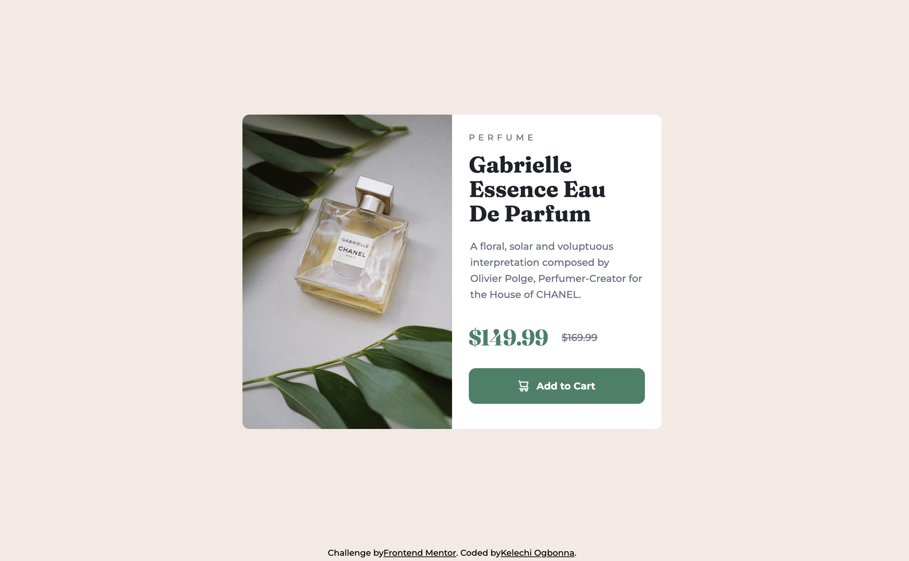

# Frontend Mentor - Product preview card component solution

## Table of contents

- [Overview](#overview)
  - [The challenge](#the-challenge)
  - [Screenshot](#screenshot)
  - [Links](#links)
- [My process](#my-process)
  - [Built with](#built-with)
  - [What I learned](#what-i-learned)
  - [Continued development](#continued-development)
  - [Useful resources](#useful-resources)
- [Author](#author)
- [Acknowledgments](#acknowledgments)

**Note: Delete this note and update the table of contents based on what sections you keep.**

## Overview

This is a solution to the [Product preview card component challenge on Frontend Mentor](https://www.frontendmentor.io/challenges/product-preview-card-component-GO7UmttRfa).

### The challenge

Users should be able to:

- View the optimal layout depending on their device's screen size
- See hover and focus states for interactive elements

### Screenshot



### Links

- Solution URL: [github.com/Kellswork/product-review-card-component](https://github.com/Kellswork/product-review-card-component)
- Live Site URL: [kellswork.github.io/product-review-card-component](https://kellswork.github.io/product-review-card-component/)

## My process

### Built with

- Semantic HTML5 markup
- CSS custom properties
- Flexbox
- Mobile-first workflow

### What I learned

1. Using the <picture> Tag for Responsive Images:
The <picture> element allows for specifying multiple sources for an image, enabling the browser to choose the best-optimized image based on the screen size and resolution. This enhances loading times and provides a visually appealing experience across various devices.

2. Using <hgroup> to Group Headings:
The <hgroup> element groups related headings, improving semantic structure and accessibility. It clarifies the hierarchical relationship between headings, making it easier for screen readers to interpret.

3. Using the <s> Tag to Indicate Old Prices:
The <s> tag visually shows the old price, indicating it is no longer valid, which is important for displaying discounts. Screen readers announce this strikethrough, enhancing clarity for visually impaired users.

4. Accessibility Considerations:
Using semantic HTML elements not only improves the user interface but also enhances accessibility for all users, making web content more navigable.

```html
<picture>
  <!-- <source srcset="/images/image-product-desktop.jpg" media="(min-width: 37.5rem)" /> -->
  <source
    srcset="/images/image-product-desktop.jpg"
    media="(min-width: 632px)"
  />
  
</picture>
```

````html
<hgroup class="product-card__title-group">
  <p class="product-card__ribbon">Perfume</p>
  <h2 class="product-card__title">Gabrielle Essence Eau De Parfum</h2>
</hgroup>
```
````
